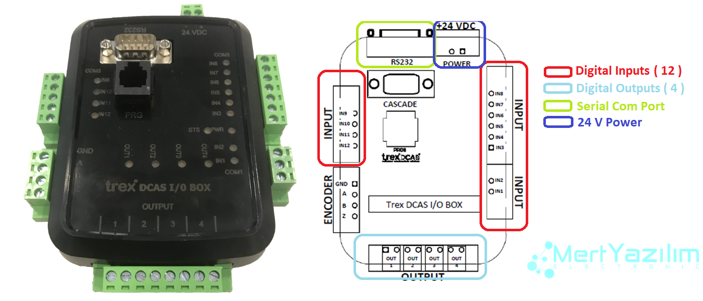

# node-red-trexmes-iot-iobox

This is a [Node-Red][1] package that enables communication with a Trex Mes IoT-IoBox hardware via serial port (rs232).
IoT-IoBox is an economical automation device whose hardware accepts 12 digital input signals and produces 4 digital output signals.
The counter total information is produced by counting the changes that occur with the 0-1 change of the signal belonging to the 12 inputs. Likewise, the cycle time of the 0-1 change of each input is also calculated in milliseconds into the card.
The last status of 4 output signals, together with these 12 input, counter and cycle values, can be read instantly with this Node-red node, and the last status of each selected signal value can be taken as a node output.

# Install

Run the following command in the root directory of your Node-RED install

    npm install node-red-trexmes-iot-iobox

# Usage

# Requirements

The package currently requires [Node.js 10][1] or higher.

# Authors

[Asaf Yurdakul][4]

[1]:http://nodered.org
[4]:https://github.com/asafyurdakul

