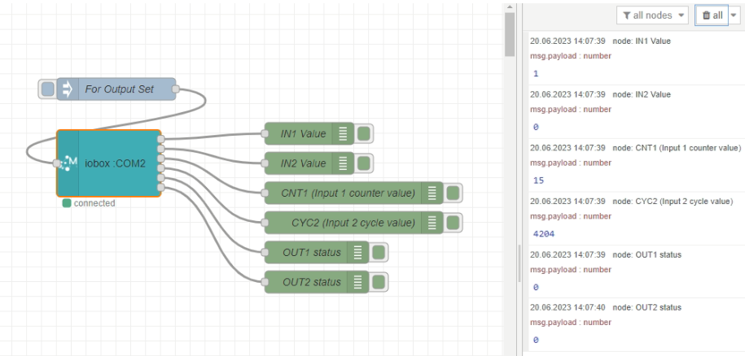
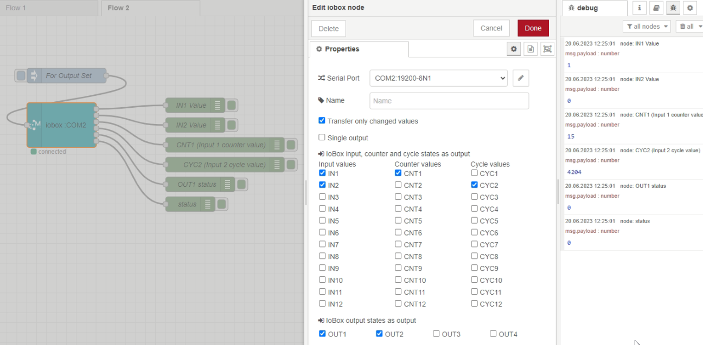
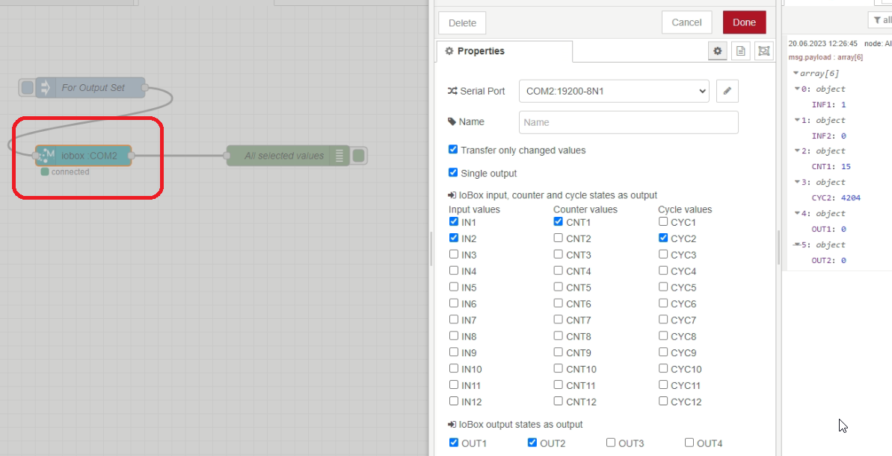
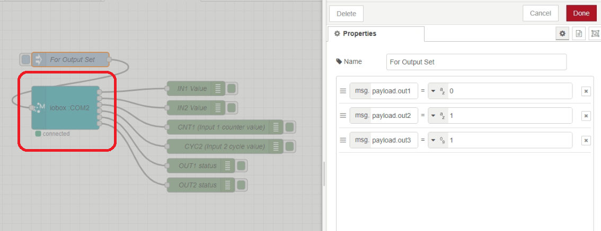

# node-red-trexmes-iot-iobox

This is a Node-Red package [Node-Red][1] that communicates via a serial port (rs232) with a Trex Mes IoT-IoBox hardware developed by Mert Software&Electronics. [Mert Software&Electronics][2] IoT-IoBox is an affordable automation device whose hardware accepts 12 digital input signals and generates 4 digital output signals. The counter total information is produced by counting the changes that occur with the 0-1 change of the signal belonging to the 12 inputs. Likewise, the cycle time of 0-1 change of each input is calculated in milliseconds to the card. With these 12 inputs, counter and loop values, the last status of 4 output signals can be read instantaneously with this Node-red node and the last status of each selected signal value can be taken as the node output.

Trex Mes IoT-IoBox hardware technical specifications
 
1. 24 VOLT POWER SUPPLY INPUT: It must be fed with 24 volt & 1 Ampere Power Supply input.
2. 12 PCS NPN OR PNP 24 VOLT INPUT
3. 4 DRY CONTACT OUTPUT: 4 x 250VAC 5A NO contact outputs
4. 24 volt PNP ENCODER INPUT:
5. CASCADE COMMUNICATION PORT INPUT:
6. RS232 COMMUNICATION PORT:

# Install

Run the following command in the root directory of your Node-RED install

    npm install node-red-trexmes-iot-iobox

# Usage

# Requirements

The package currently requires [Node.js 18.16][1] or higher.

# Authors

[Asaf Yurdakul][4]

[1]:http://nodered.org
[2]:https://mertyazilim.com.tr/
[4]:https://github.com/asafyurdakul

